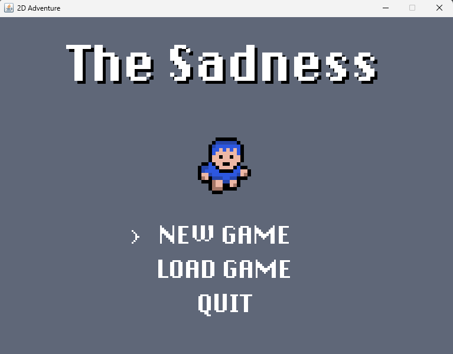
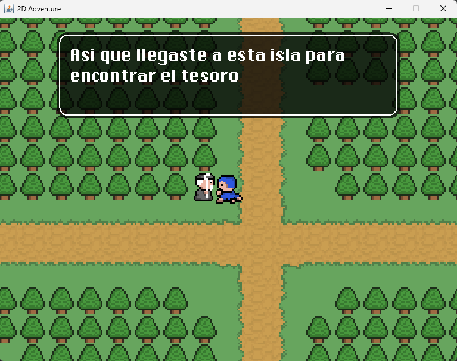
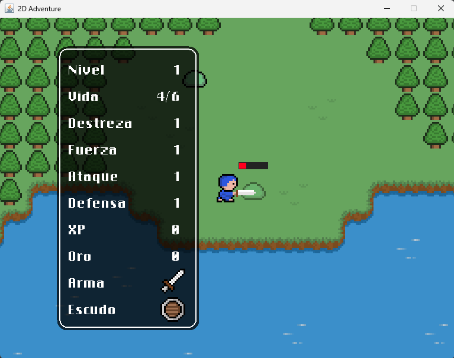

<div align="center">
  <h1>The Sadness</h1>
  <p><em>Un juego RPG en 2D desarrollado desde cero en Java</em></p>
  
</div>

<br>

## Acerca del juego

Toma el control de un aventurero solitario que llega a una isla misteriosa en busca de un tesoro oculto. Diseñado como un clásico RPG de acción con perspectiva top-down (cenital), deberás explorar un amplio mapa delimitado por cuadrículas (tiles), conversar con pintorescos NPCs y sobrevivir a enfrentamientos en tiempo real contra enemigos, mientras gestionas tu vida y mejoras tus estadísticas base recolectando nuevo equipamiento. 

## Características principales del código

*   **Bucle de Juego Custom (Game Loop):** Implementación de un bucle de juego basado en hilos (`Thread`) con control manual de Delta Time, lo que garantiza una tasa estable de actualización lógica (`update()`) y dibujado (`repaint()`) a 60 FPS fijos.
*   **Gestión de Memoria y Renderizado Eficiente:** Sistema de dibujado que solo renderiza los *tiles* y entidades que se encuentran estrictamente dentro de los límites visuales de la cámara del jugador (Culling), evitando la sobrecarga de dibujar el mapa entero (`50x50` tiles).
*   **Colisiones por AABB (Axis-Aligned Bounding Box):** Algoritmo de detección de colisiones mediante rectángulos invisibles (`solidArea`), que evalúa matemáticamente las cuatro esquinas de la hitbox prediciendo la posición futura para evitar la superposición con elementos sólidos del mapa y otras entidades.
*   **IA de NPC y Enemigos:** Algoritmos rudimentarios para que las entidades realicen caminatas aleatorias (`Random Walk`) apoyados de contadores de refresco de frames, dándole dinamismo y vida propia a los NPCs y monstruos del mapa.

## 📁 Estructura del Proyecto

El repositorio está organizado de la siguiente manera para facilitar el mantenimiento, basándose en un patrón MVC implícito:

```text
the-sadness/
│
├── main/                # Bucle principal, UI, punto de entrada y utilidades
├── entity/              # Atributos físicos, estados, Player y NPCs
├── monster/             # Enemigos del juego y lógicas de IA (Random Walk)
├── object/              # Elementos interactuables y de equipo (llaves, espadas, etc.)
├── tile/                # Gestión del terreno, renderizado y carga de mapas
└── handler/             # Lógica de entrada del usuario (teclado/mouse) y eventos
```

## Imágenes del proyecto

<div align="center">
  
  
  
  <br>
  <em>De izquierda a derecha: La pantalla de inicio del juego, interacción y diálogos con un NPC, y el sistema de combate en tiempo real contra un slime.</em>
</div>
